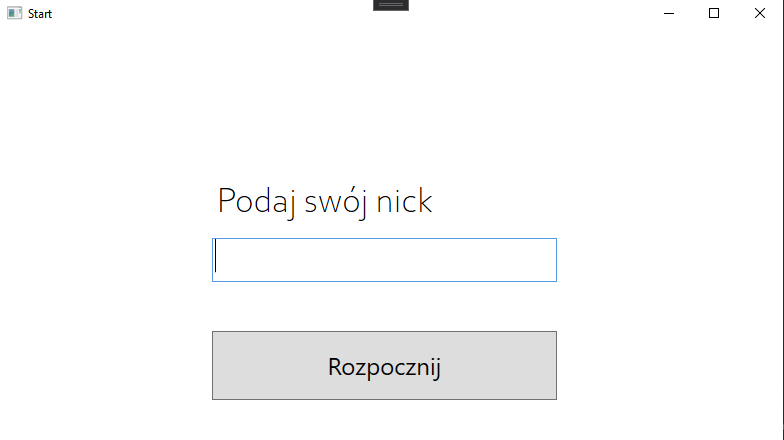
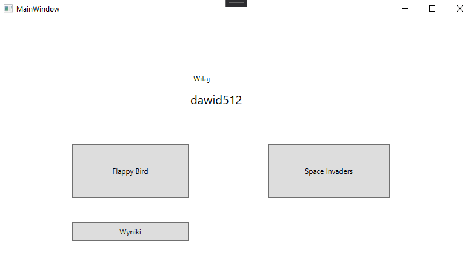
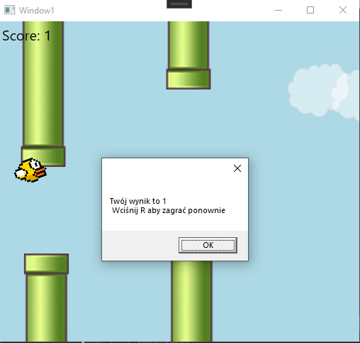
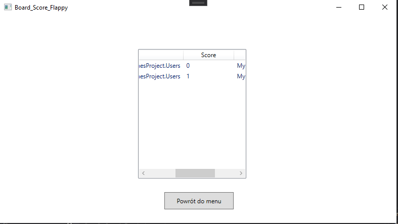
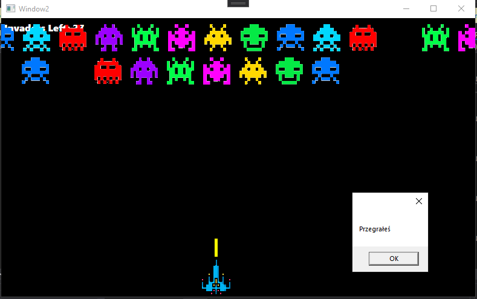

# Program stworzony na potrzeby zadania

## Spis treści 
* [Teść zadania](#Teść-Zadania)
* [Screenshots](#Screenshots)

## Teść Zadania
Na potrzebę zaliczenia przedmiotu stwórz aplikację w WPF.

## Screenshots

## Do poprawienia 
Poprawić wyświetlanie wyników
adres do zdjęc w spaceinvarder
